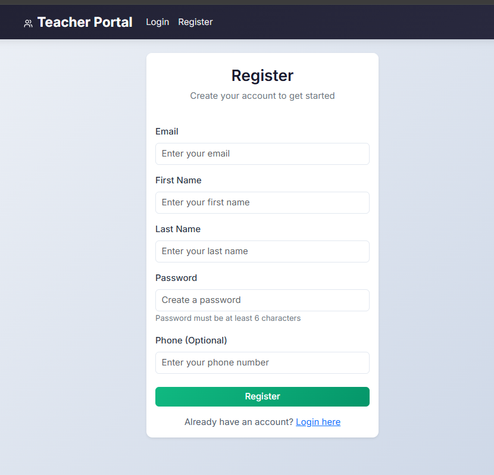
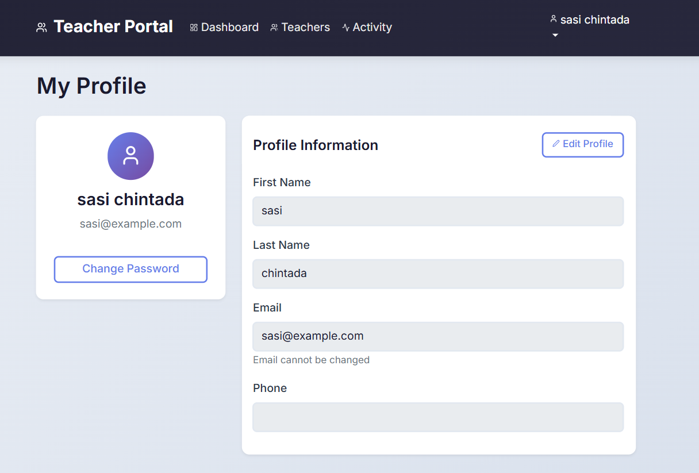

---
#                🎓 Teacher Portal – Full Stack Application


---

## 📌 Project Description

**Teacher Portal** is a full-stack web application that helps educational institutions manage their teaching staff efficiently. It provides user authentication, teacher management, activity tracking, and an interactive dashboard with statistics.

This project demonstrates full-stack development with **CodeIgniter 4, React.js, MySQL**, and **JWT authentication**.

---

## 🚀 Features

### ✅ Implemented Features

* **User Authentication** – Register, login with JWT tokens
* **Token-based Authorization** – Protected API endpoints
* **Teacher Management** – Create, read, update, delete teachers
* **1-1 Relationship** – auth_user and teachers tables with foreign key
* **Single POST API** – Creates user and teacher in one transaction
* **Dashboard** – Statistics cards with interactive charts
* **Activity Logs** – Track all user actions with timestamps and IP addresses
* **Search & Filter** – Search by name, filter by university/gender
* **Export to CSV** – Download teacher data
* **Auto-save Draft** – Automatically save teacher form drafts
* **Profile Management** – Edit profile and change password

---

## 🛠 Tech Stack

### 🖥 Frontend

* React 18
* HTML / CSS / JavaScript
* Bootstrap 5
* Chart.js (Data Visualization)
* Axios (HTTP Client)
* React Router DOM (Navigation)
* React Toastify (Notifications)

### ⚙️ Backend

* CodeIgniter 4.7.2
* PHP 8.2
* RESTful API
* JWT Authentication
* CORS Enabled

### 🗄 Database

* MySQL / MariaDB
* 3 Tables with Foreign Key Constraints

---

## 📂 Project Structure

```bash
TeacherPortal/
├── frontend/
│   ├── src/
│   │   ├── components/
│   │   │   ├── Navbar.js
│   │   │   ├── PrivateRoute.js
│   │   │   ├── TeacherForm.js
│   │   │   └── SessionTimeout.js
│   │   ├── pages/
│   │   │   ├── Login.js
│   │   │   ├── Register.js
│   │   │   ├── Dashboard.js
│   │   │   ├── Teachers.js
│   │   │   ├── TeacherFormPage.js
│   │   │   ├── Profile.js
│   │   │   ├── ChangePassword.js
│   │   │   └── ActivityLogs.js
│   │   ├── services/
│   │   │   └── api.js
│   │   ├── App.js
│   │   ├── App.css
│   │   └── index.js
│   └── package.json
├── backend/
│   ├── app/
│   │   ├── Config/
│   │   │   ├── Routes.php
│   │   │   ├── Filters.php
│   │   │   └── Events.php
│   │   ├── Controllers/
│   │   │   ├── Auth.php
│   │   │   ├── Teacher.php
│   │   │   └── Activity.php
│   │   ├── Models/
│   │   │   ├── AuthUserModel.php
│   │   │   └── TeacherModel.php
│   │   └── Libraries/
│   │       └── JWT.php
│   ├── public/
│   ├── .env
│   └── composer.json
├── screenshots/
│   ├── login.png
│   ├── register.png
│   ├── dashboard.png
│   ├── teachers.png
│   ├── add-teacher.png
│   ├── profile.png
│   └── activity-logs.png
├── database.sql
├── README.md
└── .gitignore
```

---

## 📸 Screenshots

### Login Page


### Register Page


### Dashboard


### Teachers Page


### Add Teacher Form


### Profile Page


### Activity Logs


---

## 📊 Database Schema

### Table: auth_user
```sql
CREATE TABLE `auth_user` (
  `id` int(11) NOT NULL AUTO_INCREMENT,
  `email` varchar(255) NOT NULL UNIQUE,
  `first_name` varchar(100) NOT NULL,
  `last_name` varchar(100) NOT NULL,
  `password` varchar(255) NOT NULL,
  `phone` varchar(20) DEFAULT NULL,
  `status` tinyint(1) DEFAULT 1,
  `created_at` timestamp NULL DEFAULT CURRENT_TIMESTAMP,
  `updated_at` timestamp NULL DEFAULT CURRENT_TIMESTAMP ON UPDATE CURRENT_TIMESTAMP,
  PRIMARY KEY (`id`)
);
```

### Table: teachers
```sql
CREATE TABLE `teachers` (
  `id` int(11) NOT NULL AUTO_INCREMENT,
  `user_id` int(11) NOT NULL,
  `university_name` varchar(255) NOT NULL,
  `gender` enum('male','female','other') NOT NULL,
  `year_joined` year(4) NOT NULL,
  `department` varchar(100) DEFAULT NULL,
  `designation` varchar(100) DEFAULT NULL,
  `qualification` varchar(255) DEFAULT NULL,
  `created_at` timestamp NULL DEFAULT CURRENT_TIMESTAMP,
  `updated_at` timestamp NULL DEFAULT CURRENT_TIMESTAMP ON UPDATE CURRENT_TIMESTAMP,
  PRIMARY KEY (`id`),
  FOREIGN KEY (`user_id`) REFERENCES `auth_user` (`id`) ON DELETE CASCADE
);
```

### Table: activity_logs
```sql
CREATE TABLE `activity_logs` (
  `id` int(11) NOT NULL AUTO_INCREMENT,
  `user_id` int(11) NOT NULL,
  `action` varchar(50) NOT NULL,
  `details` text,
  `ip_address` varchar(45) DEFAULT NULL,
  `user_agent` varchar(255) DEFAULT NULL,
  `created_at` timestamp NULL DEFAULT CURRENT_TIMESTAMP,
  PRIMARY KEY (`id`),
  FOREIGN KEY (`user_id`) REFERENCES `auth_user` (`id`) ON DELETE CASCADE
);
```

---

## 🔌 API Endpoints

| Method | Endpoint | Description 
|--------|----------|------------
| POST | `/api/auth/register` | Register new user 
| POST | `/api/auth/login` | Login user 
| POST | `/api/teachers` | Create teacher 
| GET | `/api/teachers` | Get all teachers 
| GET | `/api/teachers/{id}` | Get single teacher 
| PUT | `/api/teachers/{id}` | Update teacher 
| DELETE | `/api/teachers/{id}` | Delete teacher 
| GET | `/api/activity/logs` | Get activity logs 

### Example Response

**Login Response:**
```json
{
  "status": true,
  "message": "Login successful",
  "token": "eyJ0eXAiOiJKV1QiLCJhbGciOiJIUzI1NiJ9...",
  "user": {
    "user_id": 1,
    "email": "user@example.com",
    "first_name": "John",
    "last_name": "Doe"
  }
}
```

---

## ⚙️ Installation

### 1️⃣ Clone the Repository

```bash
git clone https://github.com/sasichintada/teacher-portal.git
cd teacher-portal
```

### 2️⃣ Database Setup

1. Start XAMPP (Apache & MySQL)
2. Open phpMyAdmin: http://localhost/phpmyadmin
3. Create database: `teacher_portal`
4. Import `database.sql` file

### 3️⃣ Install Backend Dependencies

```bash
cd backend
composer install
cp .env.example .env
```

**Configure `.env` file:**
```env
CI_ENVIRONMENT = development

database.default.hostname = localhost
database.default.database = teacher_portal
database.default.username = root
database.default.password = 
database.default.DBDriver = MySQLi
database.default.port = 3306

jwt.secret = "your-secret-key-32-characters-long"
jwt.expiry = 3600
```

### 4️⃣ Install Frontend Dependencies

```bash
cd ../frontend
npm install
```

### 5️⃣ Run the Application

```bash
# Backend (Terminal 1)
cd backend
php spark serve --port=8080

# Frontend (Terminal 2)
cd frontend
npm start
```

---

## ▶️ Usage

1. Open `http://localhost:3000` in your browser
2. Register a new account
3. Login with your credentials
4. Explore dashboard with statistics and charts
5. Add new teachers
6. View all teachers in datatable
7. Search, filter, and export teachers
8. View activity logs
9. Update your profile
10. Change password

---

## 🔑 Test Credentials

| Email | Password |
|-------|----------|
| sasi@example.com | 123456 |
| sarah@example.com | password123 |

---

## 👨‍💻 Author

**Sasi Chintada**

---

## 📄 License

This project is licensed under the MIT License.

---
