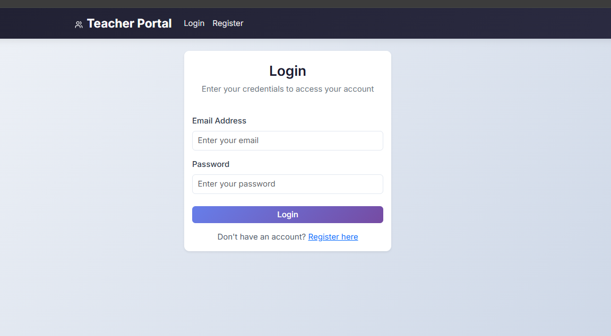
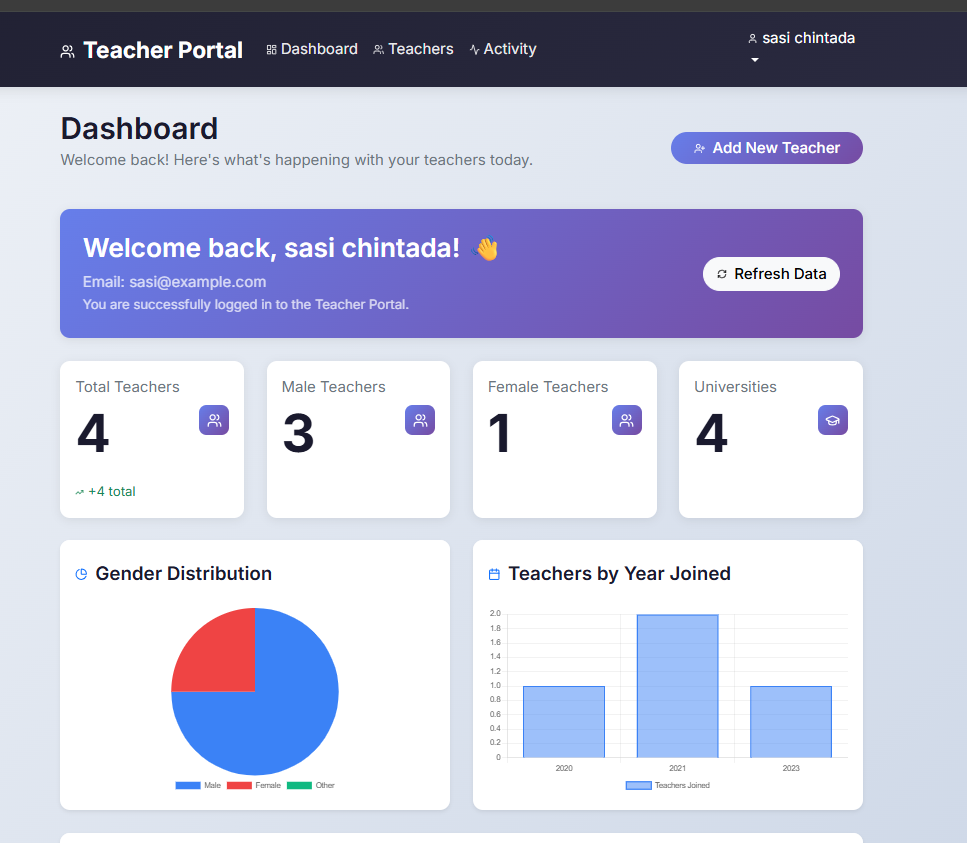
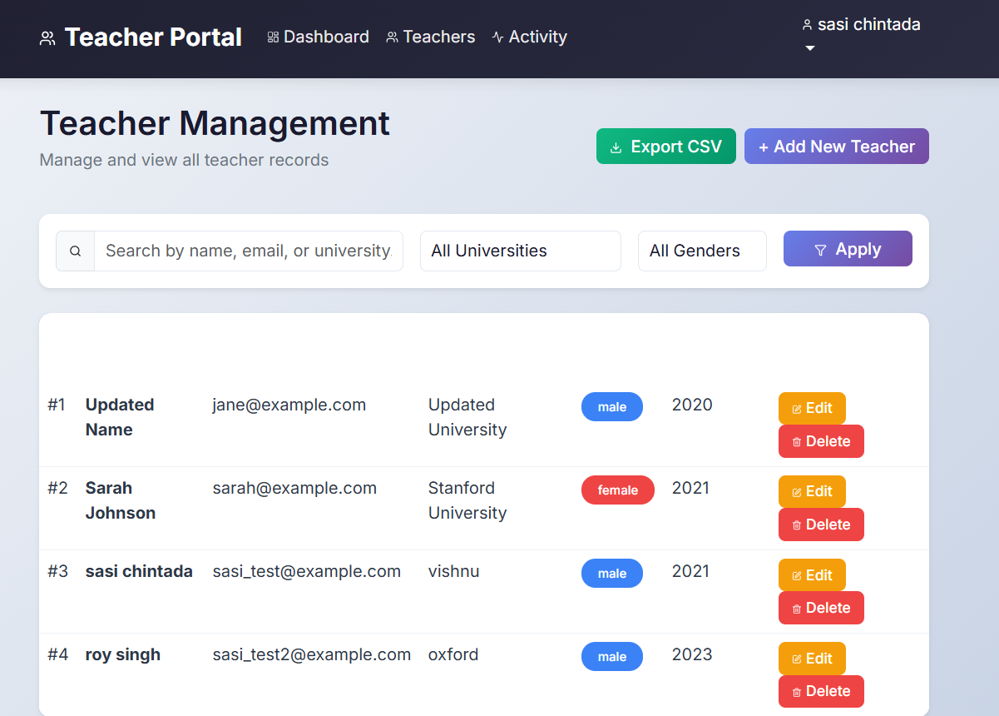
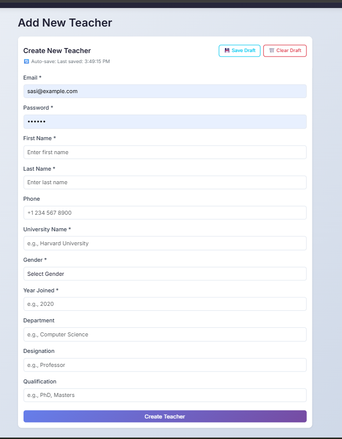
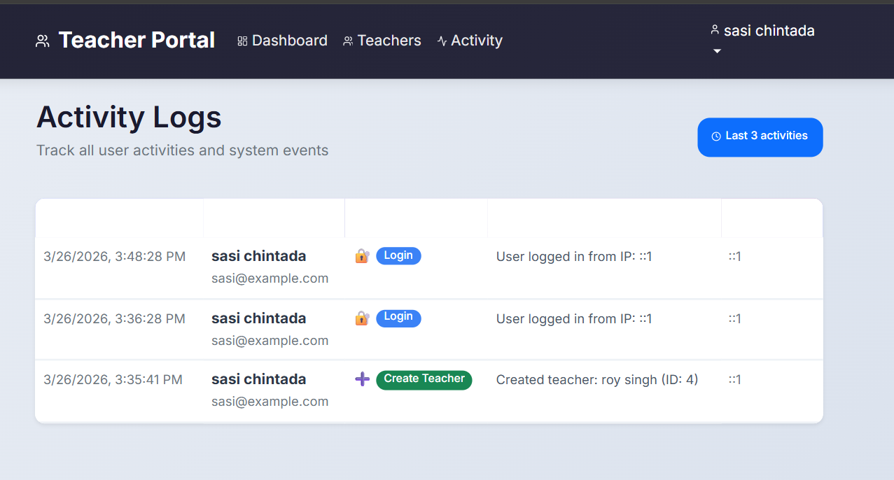

```markdown
# 🎓 Teacher Portal – Full Stack Application

A complete teacher management system built with **CodeIgniter 4** (Backend) and **React.js** (Frontend) featuring JWT authentication, teacher CRUD operations, and interactive dashboard.

---

## 📌 Project Description

**Teacher Portal** is a full-stack web application that helps educational institutions manage their teaching staff efficiently. It provides user authentication, teacher management, activity tracking, and an interactive dashboard with statistics.

This project demonstrates full-stack development with **CodeIgniter 4, React.js, MySQL**, and **JWT authentication**.

---

## 🚀 Features

- **User Authentication** – Register, login with JWT tokens
- **Token-based Authorization** – Protected API endpoints
- **Teacher Management** – Create, read, update, delete teachers
- **1-1 Relationship** – auth_user and teachers tables with foreign key
- **Single POST API** – Creates user and teacher in one transaction
- **Dashboard** – Statistics cards with charts
- **Activity Logs** – Track all user actions
- **Search & Filter** – Search by name, filter by university/gender
- **Export to CSV** – Download teacher data

---

## 🛠 Tech Stack

### Frontend
- React 18
- Bootstrap 5
- Chart.js
- Axios
- React Router DOM
- React Toastify

### Backend
- CodeIgniter 4.7.2
- PHP 8.2
- RESTful API
- JWT Authentication
- CORS Enabled

### Database
- MySQL / MariaDB

---

## 📂 Project Structure

```
teacher-portal/
├── backend/
│   ├── app/
│   │   ├── Config/
│   │   ├── Controllers/
│   │   ├── Models/
│   │   └── Libraries/
│   ├── public/
│   └── .env
├── frontend/
│   ├── src/
│   │   ├── components/
│   │   ├── pages/
│   │   └── services/
│   └── package.json
├── screenshots/
├── database.sql
└── README.md
```

---

## 📸 Screenshots

### Login Page


### Dashboard


### Teachers Page


### Add Teacher Form


### Activity Logs


---

## 📊 Database Schema

### Table: auth_user
```sql
CREATE TABLE `auth_user` (
  `id` int(11) NOT NULL AUTO_INCREMENT,
  `email` varchar(255) NOT NULL UNIQUE,
  `first_name` varchar(100) NOT NULL,
  `last_name` varchar(100) NOT NULL,
  `password` varchar(255) NOT NULL,
  `phone` varchar(20) DEFAULT NULL,
  `status` tinyint(1) DEFAULT 1,
  `created_at` timestamp NULL DEFAULT CURRENT_TIMESTAMP,
  `updated_at` timestamp NULL DEFAULT CURRENT_TIMESTAMP ON UPDATE CURRENT_TIMESTAMP,
  PRIMARY KEY (`id`)
);
```

### Table: teachers
```sql
CREATE TABLE `teachers` (
  `id` int(11) NOT NULL AUTO_INCREMENT,
  `user_id` int(11) NOT NULL,
  `university_name` varchar(255) NOT NULL,
  `gender` enum('male','female','other') NOT NULL,
  `year_joined` year(4) NOT NULL,
  `department` varchar(100) DEFAULT NULL,
  `designation` varchar(100) DEFAULT NULL,
  `qualification` varchar(255) DEFAULT NULL,
  `created_at` timestamp NULL DEFAULT CURRENT_TIMESTAMP,
  `updated_at` timestamp NULL DEFAULT CURRENT_TIMESTAMP ON UPDATE CURRENT_TIMESTAMP,
  PRIMARY KEY (`id`),
  FOREIGN KEY (`user_id`) REFERENCES `auth_user` (`id`) ON DELETE CASCADE
);
```

---

## 🔌 API Endpoints

| Method | Endpoint | Description | Auth |
|--------|----------|-------------|------|
| POST | `/api/auth/register` | Register new user | ❌ |
| POST | `/api/auth/login` | Login user | ❌ |
| POST | `/api/teachers` | Create teacher | ✅ |
| GET | `/api/teachers` | Get all teachers | ✅ |
| PUT | `/api/teachers/{id}` | Update teacher | ✅ |
| DELETE | `/api/teachers/{id}` | Delete teacher | ✅ |
| GET | `/api/activity/logs` | Get activity logs | ✅ |

---

## ⚙️ Installation

### 1️⃣ Prerequisites

- PHP 8.2+ (XAMPP)
- MySQL 5.7+ (XAMPP)
- Node.js 18+
- Composer

### 2️⃣ Database Setup

1. Start XAMPP (Apache & MySQL)
2. Open phpMyAdmin: http://localhost/phpmyadmin
3. Create database: `teacher_portal`
4. Import `database.sql` file

### 3️⃣ Backend Setup

```bash
cd backend
composer install
cp .env.example .env
```

Edit `.env`:
```env
database.default.database = teacher_portal
database.default.username = root
database.default.password = 
jwt.secret = "your-secret-key-32-characters-long"
```

Start backend:
```bash
php spark serve --port=8080
```

### 4️⃣ Frontend Setup

```bash
cd frontend
npm install
npm start
```

### 5️⃣ Access Application

- Frontend: http://localhost:3000
- Backend API: http://localhost:8080

---

## ▶️ Usage

1. Open `http://localhost:3000` in browser
2. Register a new account
3. Login with credentials
4. View dashboard with statistics
5. Add new teachers
6. View all teachers in datatable
7. Search, filter, and export teachers
8. View activity logs

---

## 🔑 Test Credentials

| Email | Password |
|-------|----------|
| sasi@example.com | 123456 |

---

## 👨‍💻 Author

**Sasi Chintada**

---
